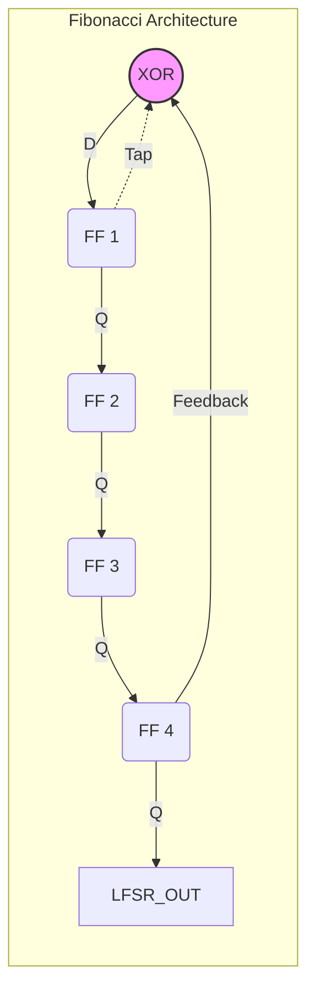
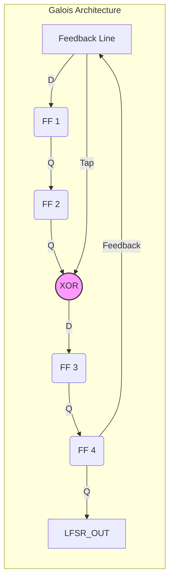

# 🔢 ענף 4: פולינומים, אוגרי הזזה ומנגנוני PRBS (שאלה 4 במבחן)

**מהות השאלה:** תרגום פולינום לייצוגים, שרטוט המעגל (Fibonacci או Galois) וכתיבת קוד Verilog.

---

## 1. המרות בסיסיות 
* **זיהוי ה-PRBS:** החזקה הגבוהה ביותר (L) קובעת את הסוג ($1+x^2+x^5 \rightarrow PRBS5$).
* **ייצוג בינארי:** "1" היכן שיש חזקה, "0" היכן שחסר. קוראים מימין לשמאל (החל מ-$x^0$).
* **כמות מצבים:** $2^L - 1$.

---

## 2. חוקי שרטוט ודיאגרמות (RTL Architecture)

### תצורת Fibonacci LFSR
שערי ה-XOR נמצאים **מחוץ** לשרשרת הפליפ-פלופים.



### תצורת Galois LFSR
שערי ה-XOR נמצאים **בתוך** השרשרת, בין הפליפ-פלופים. ה-Feedback יוצא מהאחרון ומזין לאחור במקביל.



---

## 3. שבלונות קוד Verilog 

### תבנית עבור Fibonacci (השמה בשורה אחת)
ביט ה-XOR נכנס ראשון, ושאר הביטים זזים.

```verilog
module prbs ( //
    input  wire clk, //
    input  wire reset, //
    output wire prbs_out //
);
    reg [1:3] lfsr; //

    always @(posedge clk or posedge reset) begin //
        if (reset) lfsr <= 3'h7; //
        else lfsr <= { (lfsr[2] ^ lfsr[3]) , lfsr[1:2] }; //
    end

    assign prbs_out = lfsr[3]; //
endmodule //
```

### תבנית עבור Galois (השמה בבלוק)
עובדים פליפ-פלופ אחרי פליפ-פלופ בגלל ה-XOR הפנימי.

```verilog
module prbs (
    input clk, //
    input reset, //
    output prbs_out //
);
    reg [4:1] lfsr; //

    always @(posedge clk or posedge reset) begin //
        if (reset) lfsr <= 4'b1111; //
        else begin //
            lfsr[1] <= lfsr[2] ^ lfsr[1]; //
            lfsr[2] <= lfsr[3]; //
            lfsr[3] <= lfsr[4]; //
            lfsr[4] <= lfsr[1]; // Feedback
        end
    end

    assign prbs_out = lfsr[1]; //
endmodule
```
